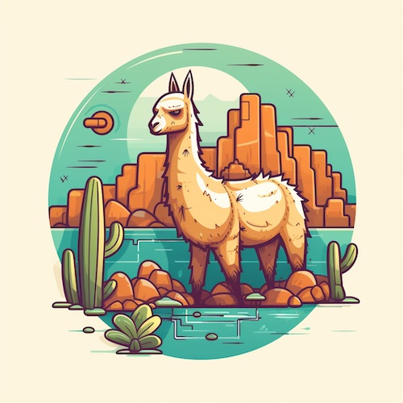

# GitaScript Chatbot 🤖

Trained specifically to answer queries based on bhagvad gita!

# Steps to run

1. Git clone this repo & create a models folder

2. Download the model currently used TheBloke's finetuned llama2 model [LLAMA](https://huggingface.co/TheBloke/Llama-2-7B-Chat-GGML/blob/main/llama-2-7b-chat.ggmlv3.q8_0.bin)

3. Place your pdfs in pdf folder to train the model

4. Activate python environment
```
python -m venv .
Scripts/activate
```

5. Install all requirements

```
pip install -r requirements.txt
```

6. Run this command to read your pdfs and store them

```Python
python convert.py
```

7. After completion run chainlit

```
chainlit run main.py -w
```

# Docker 

Creating image locally

```
docker build -t chatbot-image .
docker run chatbot-image 
```

# Kubernetes

Download kubectl cli & start a cluster

Run the following commands to get manifest files:

```
kubectl apply -f deployment.yaml
kubectl apply -f service.yaml
```
 
# Llama 😊



