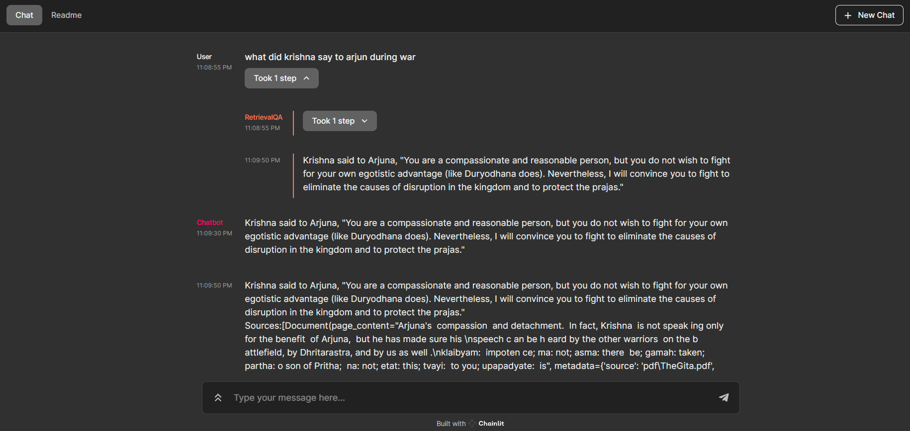

# GitaScript Chatbot 🤖

Trained specifically to answer queries based on Bhagavad Gita!
<br><br>

## Steps to Run

- **Git Clone and Create Models Folder:**
  - Clone this repository and create a "models" folder.<br>

- **Download the LLAMA Model:**
  - Download TheBloke's fine-tuned Llama2 model and place it in models folder created [LLAMA](https://huggingface.co/TheBloke/Llama-2-7B-Chat-GGML/blob/main/llama-2-7b-chat.ggmlv3.q8_0.bin).<br>

- **Add PDFs for Model Training:**
  - Place your PDF files in the "pdf" folder to train the model.<br>

- **Activate Python Environment:**
  - Create and activate a Python virtual environment:
    ```shell
    python -m venv .
    Scripts/activate
    ```

- **Install Required Packages:**
  - Install all required Python packages:
    ```shell
    pip install -r requirements.txt
    ```

- **Run PDF Conversion:**
  - Execute the following command to read your PDFs and store them:
    ```python
    python convert.py
    ```

- **Run Chatbot with Chainlit:**
  - After the conversion is complete, run the chatbot using Chainlit:
    ```shell
    chainlit run main.py -w
    ```
    <br>

## Docker 

- **Create Docker Image Locally:**<br><br>
  - Build a Docker image locally with the following commands:
    ```shell
    docker build -t chatbot-image .
    docker run chatbot-image 
    ```
  - Pull my docker repo:
    ```shell
    docker pull aryax9/chatbot-llama2-gitascript:latest
    ```
    <br>
  
  
## Kubernetes

- **Download kubectl CLI and Set Up a Cluster:**
  - Download the kubectl command-line interface (CLI) and set up a Kubernetes cluster.

- **Apply Kubernetes Manifests:**
  - Run the following commands to apply Kubernetes manifest files:
    ```shell
    kubectl apply -f deployment.yaml
    kubectl apply -f service.yaml
    ```

- **Check Deployed Pods:**
  - To see the deployed pods, use the following commands:
    ```shell
    kubectl get deploy -o wide
    kubectl get pod -o wide
    ```
    <br>

## Welcome Page:


<br>

## Chatbot Response:


<br>

## Llama 


